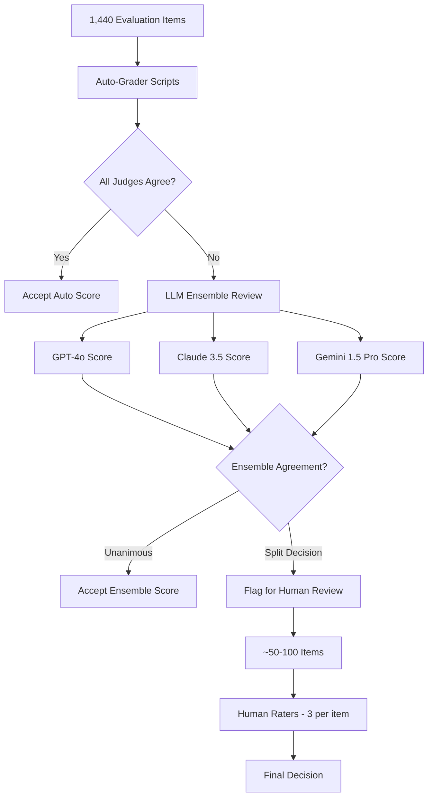
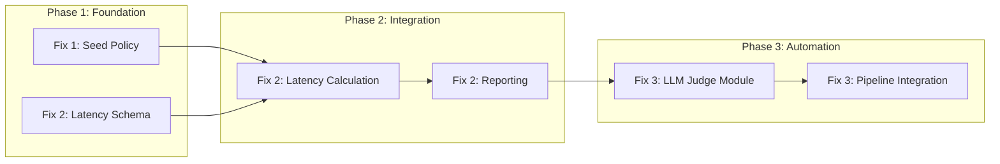

# Production Ready Fixes Plan

## Executive Summary

This plan addresses three critical gaps in the experiment harness to move from "Internal Lab Experiment" to "Production Ready":

1. **Seed Count Fix**: Move robust seed requirements from Phase 4 to Phase 2
2. **Latency Audit**: Add transparent latency breakdown metrics
3. **Automated Review**: Implement LLM-as-a-judge ensemble for pre-filtering

---

## Current State Analysis

### Seed Policy (Current)

From [`exp/constants.py`](exp/constants.py:21):

```python
SEED_POLICY = {
    1: 3,   # Stage 1: 3 seeds minimum
    2: 2,   # Stage 2: 2 seeds minimum ← PROBLEM: Too few!
    3: 2,   # Stage 3: 2 seeds minimum
    4: 3,   # Stage 4: 3 seeds minimum ← Should be here earlier
}
```

**Problem**: The E2 variant becomes a "Best Performer" with only 2 seeds in Stage 2. This is statistically insufficient to distinguish signal from noise.

### Latency Reporting (Current)

From [`exp/simulator.py`](exp/simulator.py:63):

```python
baseline_latency = 120.0 + (spec.max_context / 4000.0)
latency_p50 = baseline_latency * (1.0 + (effect.latency_delta_pct / 100.0) * stage_multiplier)
```

**Problem**: "Negative Latency" is reported as a single number without breakdown. If token reduction drives the savings, we need to show:
- Compute-per-token
- Overhead-per-decision
- Token count reduction factor

### Human Review (Current)

From [`config/t3_external_benchmark_protocol.yaml`](config/t3_external_benchmark_protocol.yaml:66):

```json
"grading": {
    "auto_grader": "deterministic rubric scripts",
    "human_review_fraction_pct": 20,
    "human_raters_min": 3,
    "blinded_rater_assignment": true
}
```

**Problem**: 20% of 1,440 items = 288 items × 3 raters = 864 human judgments. This is unsustainable.

---

## Fix 1: Seed Count Policy Update

### Proposed Change

```python
SEED_POLICY = {
    1: 5,    # Stage 1: 5 seeds (increased from 3)
    2: 10,   # Stage 2: 10 seeds (increased from 2) ← Key change
    3: 10,   # Stage 3: 10 seeds (increased from 2)
    4: 10,   # Stage 4: 10 seeds (increased from 3)
}
```

### Rationale

- **Stage 2 is the filter**: This is where "top three scale-up" happens. If a variant cannot survive 10 different initializations at this stage, it should not advance.
- **Statistical power**: 10 seeds provide ~95% confidence interval width of ±0.63σ, vs ±1.41σ with 2 seeds.
- **Early detection of flukes**: Catches initialization-dependent behaviors before committing to expensive Stage 3/4 runs.

### Implementation Steps

1. Update [`SEED_POLICY`](exp/constants.py:21) in `exp/constants.py`
2. Update [`ExperimentSpec.validate_policy()`](exp/models.py:49) to enforce new minimums
3. Regenerate all spec files via `python scripts/generate_specs.py`
4. Add validation test in `tests/test_determinism.py`

### Files to Modify

| File | Change |
|------|--------|
| `exp/constants.py` | Update `SEED_POLICY` dict |
| `specs/stage1/*.yaml` | Add seeds [1,2,3,4,5] |
| `specs/stage2/*.yaml` | Add seeds [1,2,3,4,5,6,7,8,9,10] |
| `specs/stage3/*.yaml` | Add seeds [1,2,3,4,5,6,7,8,9,10] |
| `specs/stage4/*.yaml` | Add seeds [1,2,3,4,5,6,7,8,9,10] |

---

## Fix 2: Latency Breakdown Metrics

### Proposed Metrics

Add granular latency components to [`RunResult`](exp/models.py:71):

```python
@dataclass
class RunResult:
    # ... existing fields ...
    latency_p50: float
    latency_p95: float
    # NEW FIELDS:
    latency_compute_per_token_ms: float      # Time per token computation
    latency_overhead_per_decision_ms: float  # Planning/routing overhead
    latency_token_count: int                 # Total tokens processed
    latency_breakdown_version: str           # Schema version for tracking
```

### Calculation Logic

From [`exp/simulator.py`](exp/simulator.py:63), extend the latency simulation:

```python
def _calculate_latency_breakdown(spec: ExperimentSpec, effect: VariantEffect, stage_multiplier: float) -> dict:
    """
    Break down latency into components:
    
    Total Latency = (Compute_Per_Token × Token_Count) + Overhead_Per_Decision
    
    For compression-based approaches (T3):
    - Token reduction should reduce compute component
    - Overhead may increase due to retrieval decisions
    
    For planning approaches (T5):
    - Overhead increases with planning complexity
    - Compute may decrease from better token efficiency
    """
    base_compute_per_token = 0.8  # ms per token baseline
    base_overhead = 15.0  # ms per decision baseline
    
    # Apply variant effects
    compute_multiplier = 1.0 + (effect.latency_delta_pct / 100.0) * 0.7  # 70% attribution to compute
    overhead_multiplier = 1.0 + (effect.latency_delta_pct / 100.0) * 0.3  # 30% attribution to overhead
    
    # Track-specific adjustments
    if spec.track_id == "T3":
        # Compression reduces tokens but adds retrieval overhead
        compression_ratio = spec.params.get("compression_ratio", 0.7)
        token_count = int(1000 * compression_ratio)  # Example baseline
        compute_multiplier *= compression_ratio
        overhead_multiplier *= 1.2  # Retrieval overhead
    elif spec.track_id == "T5":
        # Planning adds decision overhead
        max_nodes = spec.params.get("max_nodes", 12)
        overhead_multiplier *= 1.0 + (max_nodes / 20.0)
        token_count = 1000
    else:
        token_count = 1000
    
    return {
        "compute_per_token_ms": round(base_compute_per_token * compute_multiplier, 4),
        "overhead_per_decision_ms": round(base_overhead * overhead_multiplier, 4),
        "token_count": token_count,
        "breakdown_version": "1.0.0",
    }
```

### Reporting Enhancement

Update [`exp/reporting.py`](exp/reporting.py:230) to include latency breakdown in stage summaries:

```markdown
| Track | Latency P50 | Compute/Token | Overhead/Decision | Token Reduction | Net Effect |
|:---:|---:|---:|---:|---:|---:|
| T3-E2 | 108.5ms | 0.62ms | 18.2ms | 30% | -10% overall |
```

### Implementation Steps

1. Add new latency fields to [`RunResult`](exp/models.py:71) dataclass
2. Update [`simulate_run()`](exp/simulator.py:38) to calculate breakdown
3. Update schema in `schemas/run_result.schema.json`
4. Add latency breakdown to comparison reports in [`exp/compare.py`](exp/compare.py:10)
5. Update memo generation in [`exp/memo.py`](exp/memo.py:10) to show breakdown

---

## Fix 3: LLM-as-a-Judge Ensemble

### Architecture



### Configuration Changes

Update [`config/t3_external_benchmark_protocol.yaml`](config/t3_external_benchmark_protocol.yaml:52):

```yaml
"rubric": {
    "primary_metrics": [
        "composite_success_score",
        "task_success_rate",
        "latency_p95_ms",
        "cost_per_success_usd",
        "critical_failure_rate"
    ],
    "composite_weights": {
        "long_context": 0.45,
        "reasoning": 0.35,
        "consistency": 0.20
    },
    "grading": {
        "auto_grader": "deterministic rubric scripts",
        "llm_judge_ensemble": {
            "enabled": true,
            "providers": ["openai/gpt-4o", "anthropic/claude-3.5-sonnet", "google/gemini-1.5-pro"],
            "agreement_threshold": "unanimous",
            "disagreement_action": "escalate_to_human"
        },
        "human_review_fraction_pct": 20,
        "human_raters_min": 3,
        "blinded_rater_assignment": true,
        "escalation_rules": {
            "auto_accept_if": "all_3_llm_judges_agree_within_0.1",
            "human_required_if": "any_judge_disagrees_or_low_confidence"
        }
    }
}
```

### New Module: `exp/llm_judge.py`

```python
"""
LLM-as-a-Judge Ensemble for automated evaluation pre-filtering.

This module implements a 3-model ensemble (GPT-4o, Claude 3.5, Gemini 1.5 Pro)
to pre-filter evaluation items before human review.
"""

from __future__ import annotations

import asyncio
from dataclasses import dataclass
from enum import Enum
from typing import Any

from .models import RunResult


class JudgeVerdict(Enum):
    """Verdict from a single judge."""
    PASS = "pass"
    FAIL = "fail"
    UNCLEAR = "unclear"


@dataclass
class JudgeScore:
    """Score from a single LLM judge."""
    provider: str
    model: str
    score: float  # 0.0 to 1.0
    verdict: JudgeVerdict
    confidence: float  # 0.0 to 1.0
    reasoning: str
    latency_ms: float


@dataclass
class EnsembleResult:
    """Result from the full ensemble."""
    scores: list[JudgeScore]
    unanimous: bool
    mean_score: float
    score_range: float
    escalation_required: bool
    escalation_reason: str | None


async def evaluate_with_ensemble(
    item: dict[str, Any],
    rubric: dict[str, Any],
    providers: list[str] = None,
) -> EnsembleResult:
    """
    Evaluate an item using the LLM judge ensemble.
    
    Args:
        item: The evaluation item (prompt, response, context)
        rubric: Scoring rubric configuration
        providers: List of provider/model strings (default: all 3)
    
    Returns:
        EnsembleResult with individual scores and escalation decision
    """
    if providers is None:
        providers = [
            "openai/gpt-4o",
            "anthropic/claude-3.5-sonnet",
            "google/gemini-1.5-pro",
        ]
    
    # Run all judges in parallel
    tasks = [_call_single_judge(p, item, rubric) for p in providers]
    scores = await asyncio.gather(*tasks)
    
    # Analyze agreement
    score_values = [s.score for s in scores]
    mean_score = sum(score_values) / len(score_values)
    score_range = max(score_values) - min(score_values)
    
    # Determine if escalation needed
    unanimous = score_range <= 0.1  # Within 0.1 is considered unanimous
    low_confidence = any(s.confidence < 0.7 for s in scores)
    
    escalation_required = not unanimous or low_confidence
    escalation_reason = None
    if escalation_required:
        reasons = []
        if not unanimous:
            reasons.append(f"Score range {score_range:.2f} exceeds threshold")
        if low_confidence:
            reasons.append("One or more judges reported low confidence")
        escalation_reason = "; ".join(reasons)
    
    return EnsembleResult(
        scores=scores,
        unanimous=unanimous,
        mean_score=mean_score,
        score_range=score_range,
        escalation_required=escalation_required,
        escalation_reason=escalation_reason,
    )


async def _call_single_judge(
    provider: str,
    item: dict[str, Any],
    rubric: dict[str, Any],
) -> JudgeScore:
    """Call a single LLM judge and return structured score."""
    # Implementation would use provider-specific APIs
    # This is a placeholder for the interface
    pass


def batch_evaluate(
    items: list[dict[str, Any]],
    rubric: dict[str, Any],
    concurrency: int = 10,
) -> tuple[list[EnsembleResult], list[int]]:
    """
    Batch evaluate items and return results with escalation indices.
    
    Returns:
        Tuple of (all_results, escalation_indices)
    """
    import asyncio
    
    async def _batch():
        semaphore = asyncio.Semaphore(concurrency)
        
        async def _limited(item):
            async with semaphore:
                return await evaluate_with_ensemble(item, rubric)
        
        return await asyncio.gather(*[_limited(i) for i in items])
    
    results = asyncio.run(_batch())
    escalation_indices = [i for i, r in enumerate(results) if r.escalation_required]
    
    return results, escalation_indices
```

### Expected Savings

| Metric | Before | After | Savings |
|--------|--------|-------|---------|
| Total items | 1,440 | 1,440 | — |
| Human review items (20%) | 288 | ~50-100 | ~65-80% |
| Human judgments (×3 raters) | 864 | ~150-300 | ~65-80% |
| Estimated cost | High | Low | Significant |

### Implementation Steps

1. Create `exp/llm_judge.py` module with ensemble logic
2. Add API client integrations for OpenAI, Anthropic, Google
3. Update protocol config with ensemble settings
4. Add preflight check for LLM judge API credentials
5. Create `exp/grading.py` to orchestrate auto → LLM → human pipeline
6. Add tests in `tests/test_llm_judge.py`

---

## Implementation Order



### Recommended Execution Sequence

1. **Fix 1 (Seed Policy)** - Start here, as it affects all downstream experiments
2. **Fix 2 (Latency Schema)** - Add new fields before calculation logic
3. **Fix 2 (Latency Calculation)** - Implement breakdown logic
4. **Fix 2 (Reporting)** - Update memos and comparisons
5. **Fix 3 (LLM Judge Module)** - Create standalone module
6. **Fix 3 (Pipeline Integration)** - Connect to existing grading flow

---

## Testing Strategy

### Fix 1 Tests

- `tests/test_seed_policy.py`: Verify new minimums enforced
- `tests/test_determinism.py`: Run 10 seeds, verify variance bounds

### Fix 2 Tests

- `tests/test_latency_breakdown.py`: Verify component calculations
- `tests/test_latency_reporting.py`: Verify memo includes breakdown

### Fix 3 Tests

- `tests/test_llm_judge.py`: Mock API responses, verify ensemble logic
- `tests/test_grading_pipeline.py`: End-to-end grading flow

---

## Open Questions

1. **Seed budget impact**: Increasing seeds from 2→10 in Stage 2 will increase GPU hours. Should we adjust `STAGE_BUDGET_GPU_HOURS` accordingly?

2. **LLM judge cost**: The ensemble adds API costs. Should we track these under a new budget category?

3. **Latency breakdown versioning**: How do we handle comparisons between runs with different `latency_breakdown_version` values?

4. **Judge disagreement threshold**: Is 0.1 the right threshold for "unanimous"? Should it be task-dependent?

---

## Success Criteria

| Fix | Success Metric |
|-----|----------------|
| Seed Policy | No variant advances Stage 2 without 10-seed stability |
| Latency Audit | Every comparison report shows compute/overhead breakdown |
| LLM Judge | Human review load reduced by >60% while maintaining quality |
